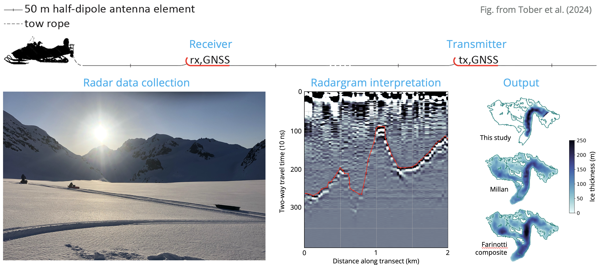
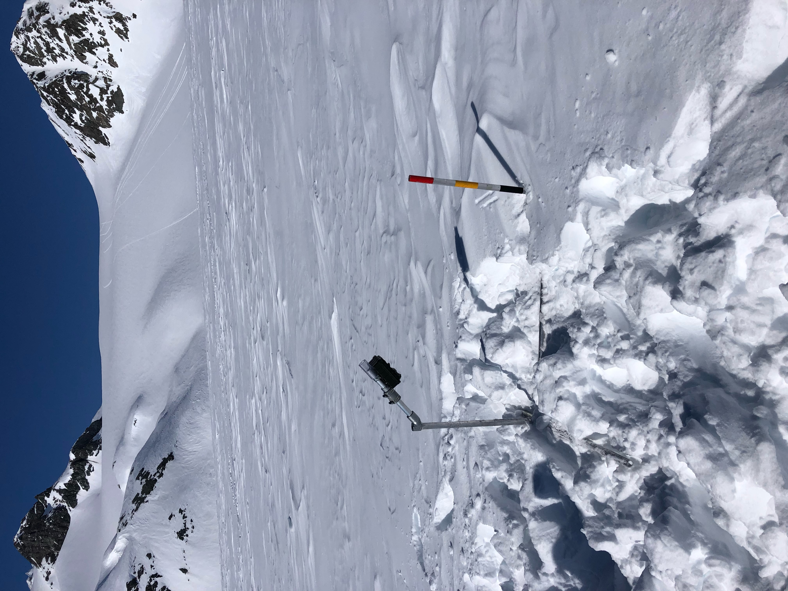
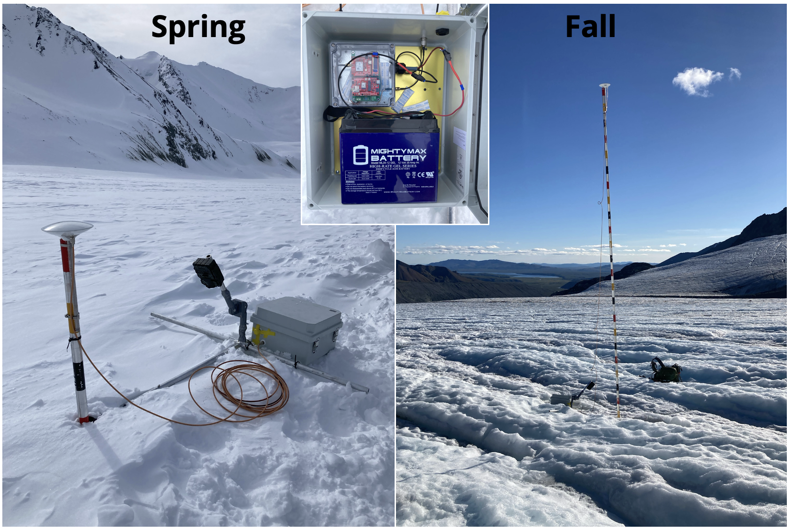
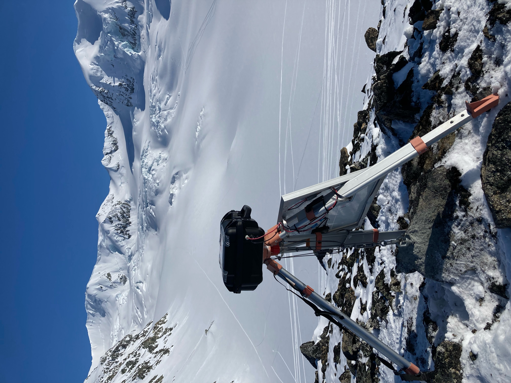
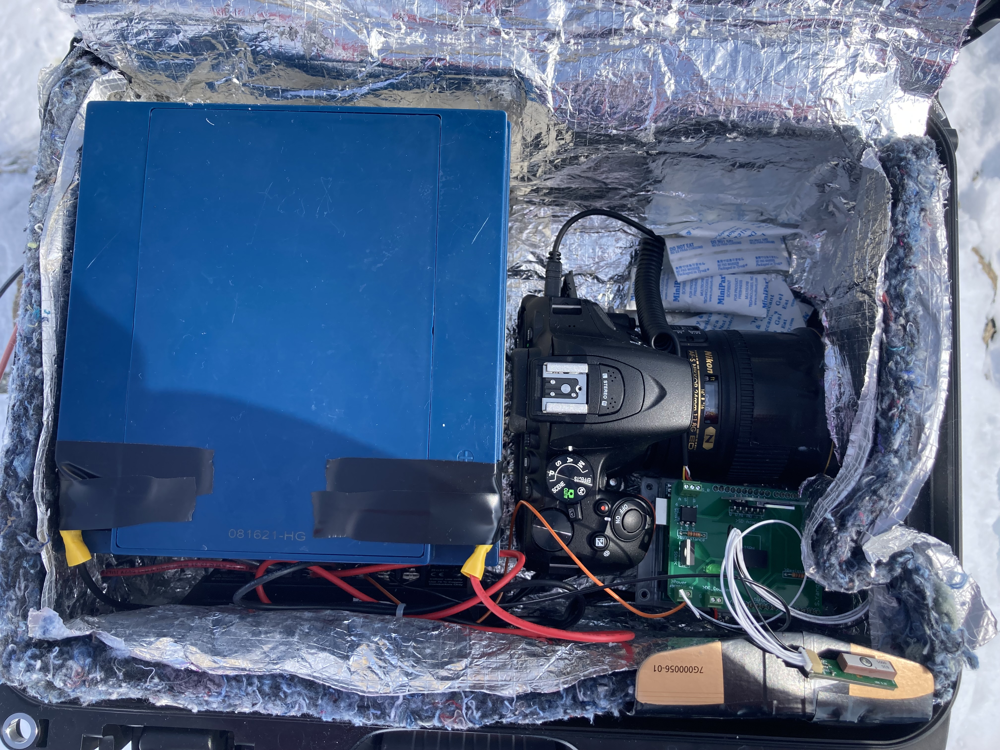
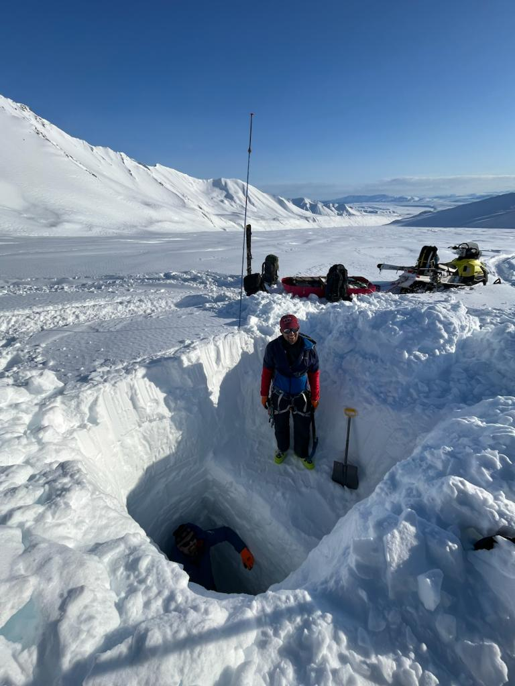

I have completed 6 field campaigns to Gulkana Glacier, Alaska from 2022-2024. I have a Wilderness First Responder (WFR) certification and have completed field safety and crevasse rescue course training. Across our numerous, we have deployed a variety of sensors, which are briefly outlined below.

Ice-penetrating radar
======
We have used the [Groundhog ice-penetrating radar system](https://doi.org/10.1017/jog.2024.53) to estimate glacier ice thickness and bed topography. Such data help to constrain ice flux estimates and reveal the ice volume in the measured portions of the glacier. The schematic below outlines the process of collecting and interpreting ice-penetrating radar data.

  
  <video id="video" height="360" controls>
    <source src="../images/fieldwork/gpr_collection.mov" type="video/mov">
    Your browser does not support the video tag.

 

Monitored banded ablation stakes
======
We have deployed monitored banded ablation stakes to obtain daily estimates of the climatic mass balance.

  
  

 

GNSS systems
======
We have built [Cryologger](https://github.com/cryologger/glacier-velocity-tracker/tree/main) GPS systems to monitor glacier flow, mass balance, and flux divergence on daily or sub-seasonal timescales. These systems are optimized for low power consumption and functionality in harsh, remote environments. We've deployed and processed these systems for both positioning (standard GNSS processing) and relative height ([GNSS reflectometry](https://github.com/kristinemlarson/gnssrefl)) to extract the most out of these data.

  

 

Time-lapse camera systems
======
We collaborated with [colleagues in our department at CMU](https://www.flanigansaluslab.com/) to build high-resolution time-lapse camera systems. Such time-lapse camera systems enable structure-from-motion photogrammetric processing to extract glacier surface elevation changes and feature-tracking to obtain spatially-distributed velocity estimates.

  
  

 

Snowpits and mass balance
======
Of course, no glacier mass balance fieldwork would be complete without digging snowpits! These are crucial to measure winter accumulation or mass balance in accumulation zones, and for obtaining snow density measurements.

  
  <video id="video" height="360" controls>
    <source src="../images/fieldwork/stake_installation.mov" type="video/mov">
    Your browser does not support the video tag.

 

